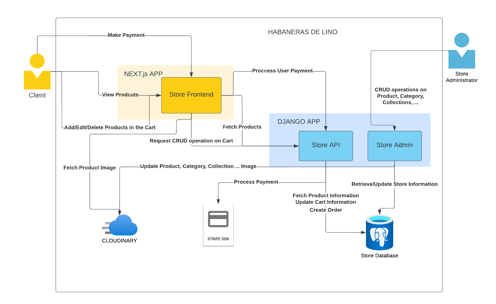

<div align="center">

# Habaneras de Lino


       


</div>

## Table of Contents
  - [Description](#description)
    - [What is Habaneras de Lino?](#habaneras)
    - [Tech Stack and Components](#stack)
  - [Installation](#installation)
  - [Screenshots of the Frontend](#screenshots_frontend)
  - [Screenshots of the Backend Admin](#screenshots)


<a name="intro"></a>
## Description

Visit the new version of the store at [habanerasdelino.com](https://habanerasdelino.com)

<a name="habaneras"></a>
### What is Habaneras de Lino?

__Habaneras de Lino__ is an online store to buy linen and cotton clothes that offer an experience of comfort, luxury ,and modernity. The clients can filter the clothing by category, collection, and other characteristics, as well as customize the products (set color, size, sleeve cut, ...). It uses Stripe for managing the payments.

<a name="stack"></a>
### Tech Stack and Components

The main components of __Habaneras de Lino__ are:
- __Next.js and React.js store Frontend ([GitHub repo](https://github.com/Ceci-Aguilera/habaneras-de-lino-frontend-v2)):__ The store UI that is visible to the clients was created using Next.js which connects to the Django API when making API calls and to Cloudinary when fetching the products', collections', and categories' images. It is contained in this repo.
- __Django and Django_Rest_Framework (This repo):__
  - __API(store_app folder):__  For managing user requests such as making CRUD operations over the store __Cart__ and making payments and orders. The code for this API can be found inside the __store_app__ folder of the Backend WebApp. Link of the [GitHub repo for the backend](https://github.com/Ceci-Aguilera/habaneras-de-lino-drf-api).
  - __The store administration (admin_app folder):__ Intended to be used by the store administrator. It is different from Django's Admin, and it allows advanced filtering and CRUD operations over products, collections, configs, orders, payments, ... .  Link of the [GitHub repo for the backend](https://github.com/Ceci-Aguilera/habaneras-de-lino-drf-api).
- __Stripe SDK (Third Party):__ For managing payments. It is accessed by Django when the user makes a purchase. [Link to Stripe](https://stripe.com).
- __Cloudinary for storing images and as CDN (Third Party):__ Used for storing all images uploaded using the Django custom store administration. The images can be seen at the store's admin and in the store frontend by clients. [Link to Cloudinary](https://cloudinary.com).
- __PostgreSQL as database (Third Party):__ Connected to the Django API. Contains all the information about the store administration.

__Note:__ The Installation and the Useful Links sections contain more-in-detail information about each component.

<div align="center">

  

</div>

<a name="installation"></a>

## Installation

1. Clone the repo:

   ```bash
   git clone https://github.com/Ceci-Aguilera/habaneras-de-lino-frontend-v2.git
   ```

1. Install dependencies:
   ```bash
   npm install
   ```

1. Configure the environment variables: Create an .env.local file inside the root folder and set up the following environment variables:

   ```text
   NEXT_PUBLIC_API_URL (The url of the backend, for example, https://backend_api.com/)
   ```

1. Run the app
   ```bash
   npx next dev
   ```

1. Congratulations =) !!! the app should be running in [localhost:3000](http://localhost:3000)

<a name="screenshots_frontend"></a>
## Screenshots of the Frontend

Should be updated soon

<a name="screenshots"></a>
## Screenshots of the custom Admin

Should be updated soon